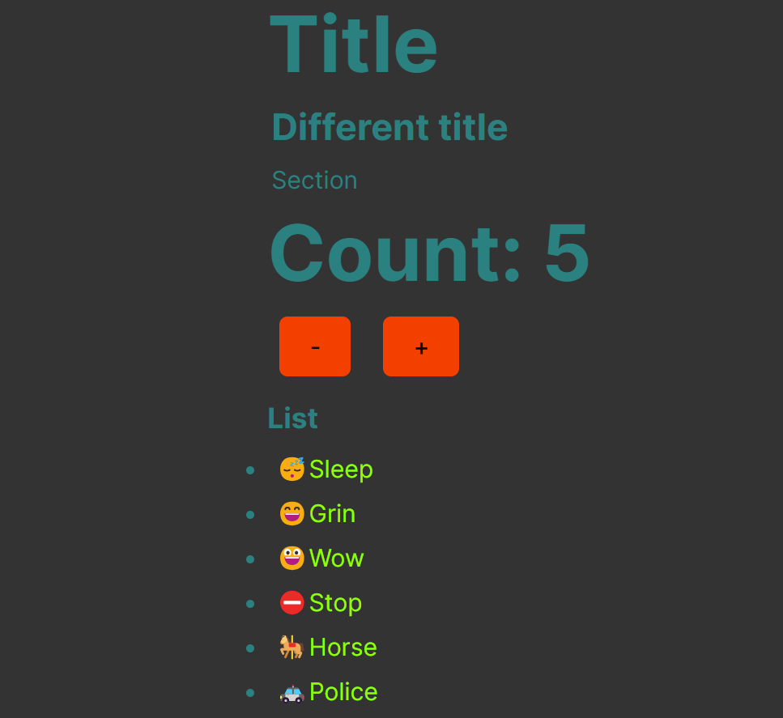

# React + TypeScript + Vite   Headings, Counter and List

### How to run the app locally:

- cd vite-project
- npm i
- npm run dev
- npm run ts:watch

## The app

### What it does

Displays a heading, subheading, counter and list. Demonstrating how to pass props and children in React using Typescript with a variety of components.

### Why I built it

To apply my understanding of passing props and children as well as generics in Typescript. This can be seen in the Heading, Section, Counter and List components

I’ve applied what I learnt here to my “Guess the Song” app

